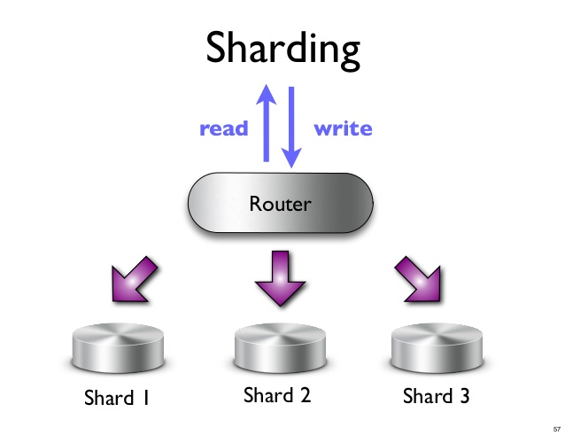

Database 
----------

## Terms
* Relational databases
* RDBMS
* NoSQL Databases: 
    * Key-Value databases
    * Document databases
    * Column family stores
    * Graph Databases
* Cluster
* Data storage
* Volumes of data
* ERP application
* Aggregate Data Models
* Collection of data
* Key-value, Document, and Column-family databases
* Aggregate-oriented databases
* Inter-aggregate relationships
* Intra-aggregate relationships
* Distribution Models
* Sharding
* Replication
* Master-slave replication
* Peer-to-peer replication
* CAP theorem
* Scaling Up - vertical scaling
* Scaling Out - horizontal scaling
* ACID
* BASE

## Good readings
[NoSQL Databases: An Overview](https://www.thoughtworks.com/insights/blog/nosql-databases-overview)
[10 things you should know about NoSQL databases](http://www.techrepublic.com/blog/10-things/10-things-you-should-know-about-nosql-databases/)
[Database per service in Microservice](http://microservices.io/patterns/data/database-per-service.html)
[Database Sharding](http://www.agildata.com/database-sharding/)
[Database Sharding Explained](http://nosql-guide.com/database-sharding-explained/)
[Linux Database tools](http://www.yolinux.com/TUTORIALS/LinuxDatabases.html)
[NoSQL and Data Scalability ](https://dzone.com/refcardz/nosql-and-data-scalability-20)

## Questions
> How to design Database for microservice ?

> What type of Database used for Big-Data ?

> What is No-Sql database ? Theory ?

> Why choose No-Sql database ?

> How to scale database in Cluster ? Methods ?

> Which DB is used ?

## NoSQL Databases

- Not using the relational model
- Running well on clusters
- Mostly open-source
- Built for the 21st century web estates
- Schema-less

### Why use ?
* Size matters:
If will be working with very large sets of data, consistently scaling is easier to achieve with many of the DBMS from NoSQL family.

* Speed:
NoSQL databases are usually faster - and sometimes extremely speedier - when it comes to writes. Reads can also be very fast depending on the type of NoSQL database and data being queried.

* Schema-free design:
Relational DBMSs require structure from the beginning. NoSQL solutions offer a large amount of flexibility.

* Automated (or easy) replications / scaling:
NoSQL databases are growing rapidly and they are being actively built today - vendors are trying to tackle common issues and one of them clearly is replication and scaling. Unlike RDBMSs, NoSQL solutions can easily scale and work with(in) clusters.

* Multiple choices:
When it comes to choosing a NoSQL data store, there are a variety of models, as we have discussed, that you can choose from to get the most out of the database management system - depending on your data type.

### Data types
* Columnar
* Key-value stores
* Document
* SearchEngine
* Hybrid

### Key-Value databases
* Riak
* Redis
* Memcached
* Berkeley DB
* upscaledb
* Couchbase

### Document databases
* MongoDB
* CouchDB
* Terrastore
* OrientDB
* RavenDB

### Column family stores
* Cassandra
* HBase
* Hypertable

### Graph Databases
* Neo4J
* Infinite Graph
* OrientDB
* FlockDB

### Search engine
* Apache Solr
* Elasticsearch
* MarkLogic

### Hybrid
* OrientDB
* MarkLogic
* ArangoDB

## Improving the performance and scalability of databases
__Methods:__
* Scaling Up - vertical Scaling: Database Mirroring and Replication, Table partition
* Scaling Out - horizontal scaling: Sharding
* Load Balancing: using proxy server.

As most NoSQL databases have been built with a scale-out mentality, sharding usually works very well

### Database Partitioning
#### Master/Slave
#### Cluster Computing
#### Table Partitioning
#### Federated Tables

> __Drawbacks:__ complex administration, lack of support for critical business requirements, and high availability limitations.  

### Sharding Database
The basic concept of Database Sharding is very straightforward: take a large database, and break it into a number of smaller databases across servers.
Advantages:
	* Smaller databases are easier to manage.
	* Smaller databases are faster.
	* Database Sharding can reduce costs.

#### Sharding Nothing

#### Sharding Disk

