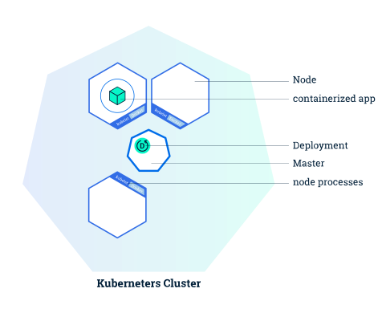
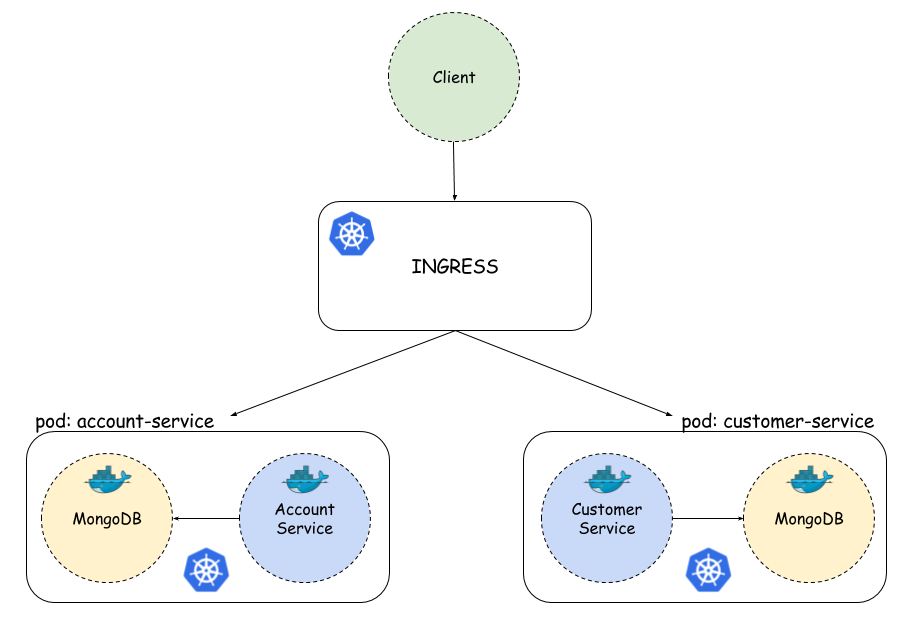
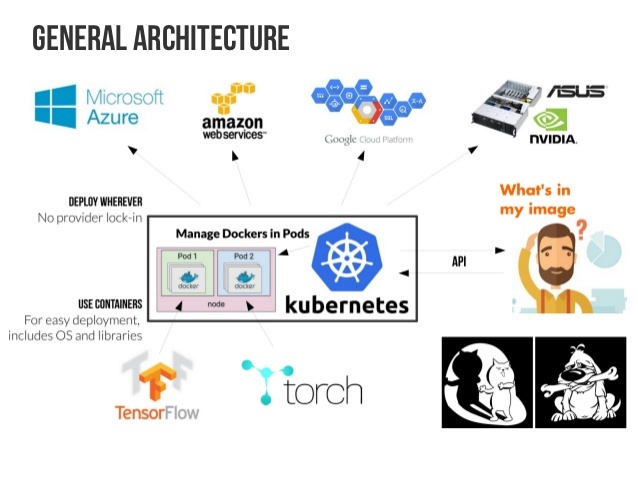
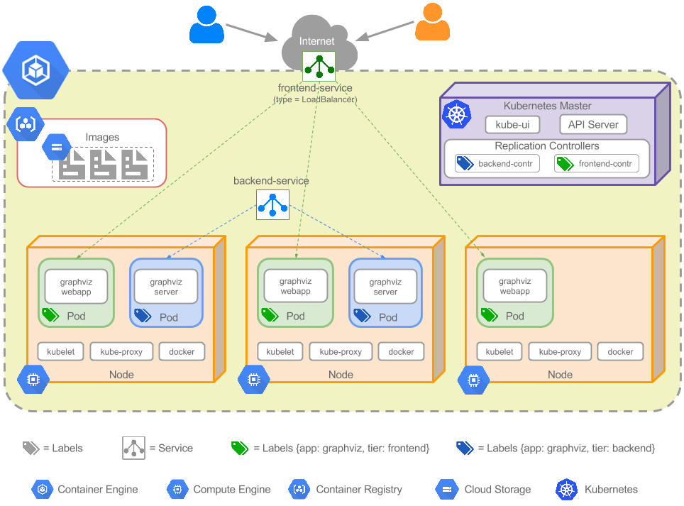
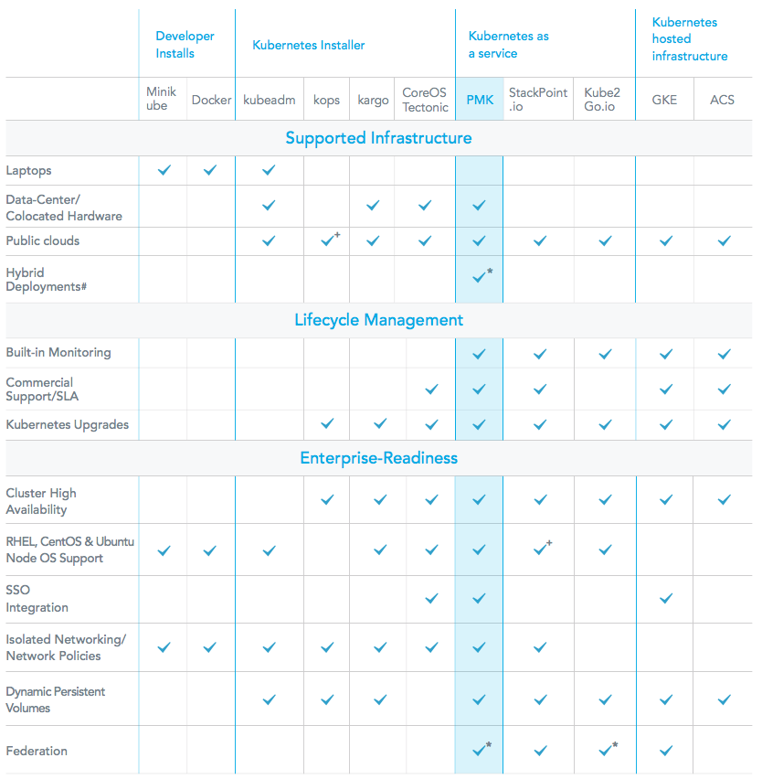
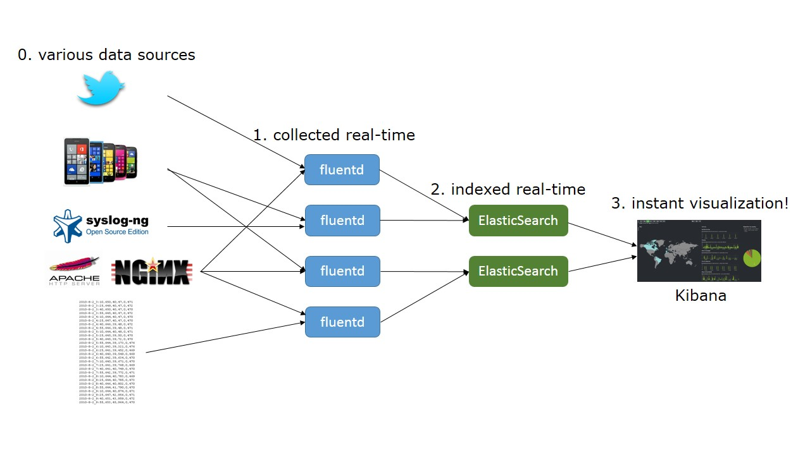
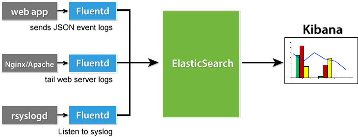
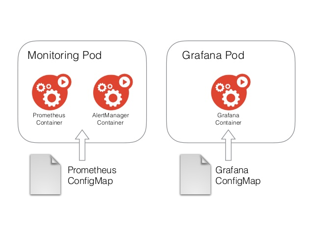
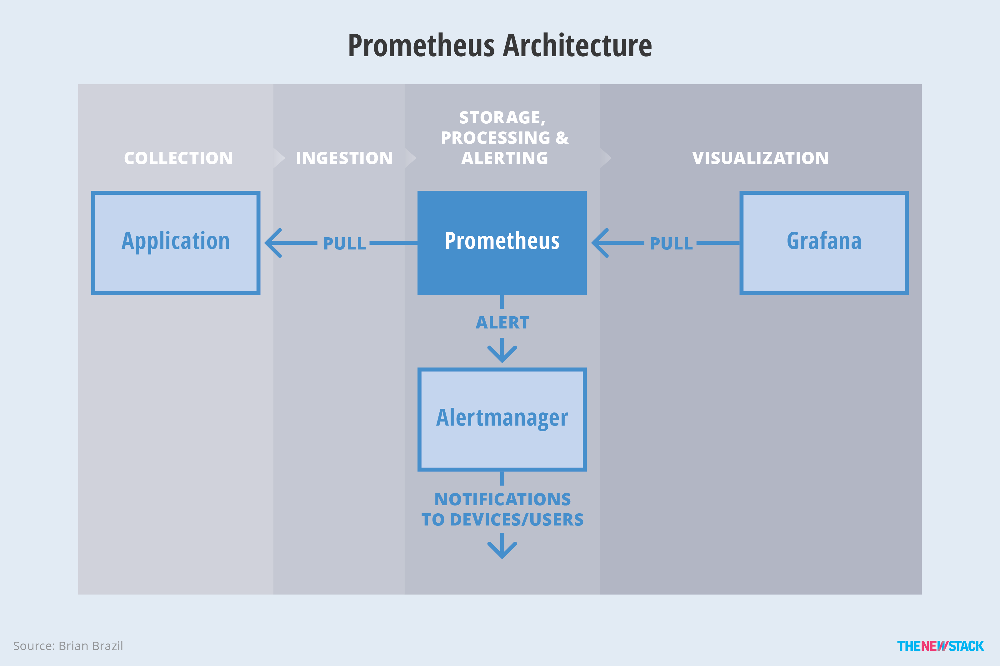

Kubernetes
=====================

## Good links
* [kubernetes-main](https://github.com/kubernetes)
* [kubernetes.github.io](https://github.com/kubernetes/kubernetes.github.io)
* [Kubernetes intro public](https://www.slideshare.net/reallavalamp/kubernetes-intro-public-kubernetes-user-group-4212015?qid=d964557b-74db-4163-a0a8-3cf85fd6972f&v=&b=&from_search=3)
* [Deploying Apache Spark on Kubernetes](http://netapp.io/2017/04/07/deploying-apache-spark-kubernetes-s3-support/)
* [10-most-common-reasons-kubernetes-deployments-fail](https://kukulinski.com/10-most-common-reasons-kubernetes-deployments-fail-part-1/)
* [Minikube workflows](http://kubecloud.io/minikube-workflows/)
* [Getting-started-with-kubernetes-via-minikube](https://medium.com/@claudiopro/getting-started-with-kubernetes-via-minikube-ada8c7a29620)
* [Enevts](https://support.sysdig.com/hc/en-us/articles/210530163-Event-integrations-Application-Events)
* [Installing KVM](https://help.ubuntu.com/community/KVM/Installation)
* [Kubernetes awesome](https://www.gitbook.com/book/ramitsurana/awesome-kubernetes/details)
* [Introduction-to-yaml-creating-a-kubernetes-deployment](https://www.mirantis.com/blog/introduction-to-yaml-creating-a-kubernetes-deployment/)
* [kubectl cheatsheet](https://kubernetes.io/docs/user-guide/kubectl/v1.6/#-em-set-context-em-)
* [Kubernetes deep dive - Part 1](https://blog.openshift.com/kubernetes-deep-dive-api-server-part-1/)
* [Microservices-with-kubernetes-and-docker](https://dzone.com/articles/microservices-with-kubernetes-and-docker)
* [Kube Hub Deployment](https://kubeapps.com/)
* [5-methods-deploy-kubernetes](https://platform9.com/blog/5-methods-deploy-kubernetes/)
* [Kubernetes v1 REST API](https://docs.openshift.org/latest/rest_api/kubernetes_v1.html)
* [Awesome-kubernetes](https://travis-ci.org/ramitsurana/awesome-kubernetes/builds/211243004)
* [Awesome-kubernetes-1](https://ramitsurana.github.io/awesome-kubernetes/)

## Kubernetes Concept




## Kubernetes Work Units
### Kubernetes Objects
### Clusters
### Master
### Nodes
### Pods
### Containers
### Services
### Deployments
### Jobs
### Replicates
### ReplicationController
### Registry
### images

## Kubernetes Workflow


## The structer of Kubernetes Object File (YAML or JSON)
Required Fields

In the .yaml file for the Kubernetes object you want to create, you’ll need to set values for the following fields:

* apiVersion - Which version of the Kubernetes API you’re using to create this object
* kind - What kind of object you want to create

* metadata - Data that helps uniquely identify the object, including a name string, UID, and optional namespace
* spec - 

### Template

```
apiVersion: extensions/v1beta1
kind: ConfigTemplate
metadata:
  name: postgresNodeConf
spec:
  ConfigMapRefs:
     - name: patroniMap
     - name: productionMap
  Template: 
     data:
         node_ip: ${status.podIP}
         dcs: ${patroniMap.dcsconn}
         cluster_name: ${productionMap.cluster}
         memory: 128MB
```

```
apiVersion: extensions/v1beta1
kind: ConfigTemplate
metadata:
  name: postgresNodeConf
spec:
  ConfigMapRefs:
     - name: patroniMap
     - name: productionMap
  Template: 
      file: templates/pg.conf.prod
```

```
apiVersion: v1
kind: Pod
metadata:
  name: pgProdPod
spec:
  containers:
    - name: postgres
      image: jberkus/patroni
      templates:
         - name: postgresNodeConf
           path: /etc/postgres/pgnode.conf
```

```
//This is a simple example of using a config map to create a single page static site.
apiVersion: v1
kind: ConfigMap
metadata:
  name: {{ template "fullname" . }}
  labels:
    heritage: {{ .Release.Service }}
    release: {{ .Release.Name }}
    chart: {{ .Chart.Name }}-{{ .Chart.Version }}
    app: {{ template "name" . }}
data:
  # When the config map is mounted as a volume, these will be created as files.
  index.html: {{ .Values.index | quote }}
test.txt: test
```

### Sample

```

apiVersion: v1
data:
  game.properties: |-
    enemies=aliens
    lives=3
    enemies.cheat=true
    enemies.cheat.level=noGoodRotten
    secret.code.passphrase=UUDDLRLRBABAS
    secret.code.allowed=true
    secret.code.lives=30
  ui.properties: |
    color.good=purple
    color.bad=yellow
    allow.textmode=true
    how.nice.to.look=fairlyNice
kind: ConfigMap
metadata:
  creationTimestamp: 2016-02-18T18:34:05Z
  name: game-config
  namespace: default
  resourceVersion: "407"-
  selflink: /api/v1/namespaces/default/configmaps/game-config
  uid: 30944725-d66e-11e5-8cd0-68f728db1985
```


## Questions
* The type of IPs in Kubernetes Cluster (Internal IP, external IP, Clsuter IP,...). How to connect IPs ? How to access Pods, Nodes, Services,... ?

> https://kubernetes.io/docs/concepts/services-networking/service/ 
> https://kubernetes.io/docs/tutorials/services/source-ip/ 

* Syntax of ConfigMap file (YAML, JSON) ?
> https://github.com/kubernetes/kubernetes.github.io/tree/master/docs/user-guide/configmap 
> https://github.com/kubernetes/kubernetes/issues/30716
> https://github.com/kubernetes/helm/tree/master/docs/examples/nginx/templates

* How to debug connection between Pods, Nodes ?
* How to use label to scale Application ?
* How to setup discover Services ?
* Replication Controller VS Deployment in Kubernetes? 
> https://stackoverflow.com/questions/37423117/replication-controller-vs-deployment-in-kubernetes 

* What is "volumn" in kubernetes ?

## The demo deployment - 1
[Hello Minikube](https://kubernetes.io/docs/tutorials/stateless-application/hello-minikube/)
[Github](https://github.com/microservices-demo/microservices-demo)

## The demo deployment - 2


[Microservices-with-kubernetes-and-docker](https://dzone.com/articles/microservices-with-kubernetes-and-docker)
[Github](https://github.com/piomin/sample-spring-microservices/tree/kubernetes)

## The demo deployment - 3

[Demochat on our local minikube cluster](https://codefresh.io/blog/kubernetes-snowboarding-everything-intro-kubernetes/)
[Github](https://github.com/containers101/demochat)

## The demo deployment - 4
[Github](https://github.com/smarterclayton/kubernetes/tree/master/examples)

## Real deployment structure with Kubernetes





### Reference design
* [The Graphviz application](http://omerio.com/2016/01/02/getting-started-with-kubernetes-on-google-container-engine/)
* [Service-discovery-using-etcd-consul-and-kubernetes](https://www.slideshare.net/SreenivasMakam/service-discovery-using-etcd-consul-and-kubernetes)
* [Consul-on-kubernetes](https://github.com/kelseyhightower/consul-on-kubernetes)
* [Sock Shop on Minikube](https://microservices-demo.github.io/microservices-demo/deployment/kubernetes-minikube.html)
* [A full on-premise kubernetes architecture in production](https://www.slideshare.net/micheleorsi/tales-from-lastminutecom-machine-room-our-journey-towards-a-full-onpremise-kubernetes-architecture-in-production-kubecon-berlin-2017)

## Solutions for settingup Kubernetes Cluster
[Pick-right-solution](https://kubernetes.io/docs/setup/pick-right-solution/)
[Platform9](https://platform9.com/docs/install-kubernetes-the-ultimate-guide/)



* __Minikube__ (Just for developing in local server)
* __Manual__ Creating a Custom Cluster from Scratch (Use the basic Kunernetes binaries)
* __Kubeadm__
`kubeadm` assumes you have a set of machines (virtual or real) that are up and running. It is designed to be part of a large provisioning system - or just for easy manual provisioning. kubeadm is a great choice where you have your own infrastructure (e.g. bare metal), or where you have an existing orchestration system (e.g. Puppet) that you have to integrate with.
* __KubeNow__
KubeNow provide an all-in-one tool for provisioning a Kubernetes cluster (e.g. Juju and Kubespray), KubeNow comes as a thin layer on top of Terraform, Packer, Ansible and kubeadm. Following this approach we aim to provide a simple, light-weight, tool for Kubernetes provisioning, while making DevOps transparent and fun.
* __Hosted solution__: `gcloud` (Google Cloud), `kops` (AWS), `bx` (Bluemix), `az` (Azure)
* __kubespray (Kargo)__ 
Kubespray is a composition of Ansible playbooks, inventory generation CLI tools and domain knowledge for generic OS/Kubernetes clusters configuration management tasks.

* __Juju__ 
* __CoreOs Tech__

### Setting up with Kubeadm
[Creating-a-kubernetes-cluster-from-scratch-with-kubeadm](https://zihao.me/post/creating-a-kubernetes-cluster-from-scratch-with-kubeadm/)
[Getting-started-with-a-multi-node-kubernetes-cluster-on-ubuntu](https://devops.profitbricks.com/tutorials/getting-started-with-a-multi-node-kubernetes-cluster-on-ubuntu/)

### Setting up with KubeNow
[KubeNow](https://pharmb.io/tool/kubenow/)
[KubeNow - Github](https://github.com/kubenow/KubeNow)


Deploying a KubeNow cluster you will get:
* A Kubernetes cluster up and running in ~10 minutes (provisioned with `kubeadm`)
* `Weave` networking
* `Traefik` HTTP reverse proxy and load balancer
* `Cloudflare` dynamic DNS configuration (Optional)
* `GlusterFS` distributed file system

### Setting up with Kubespray (Kargo)
[Main page](https://kubespray.io/)
[Installing Cluster with Kubespray](http://slides.com/smainekahlouch/deck-1#/)
[Kargo](http://www.yet.org/2016/07/kargo/)
[Kubespray](https://github.com/kubespray/kubespray-cli)
[Kubespray Demo](https://asciinema.org/a/065mhh5pzmxcwxgp6evebarvd?speed=4)
[Deploy a Kubernetes Cluster with Kargo ](https://www.youtube.com/watch?v=N9q51JgbWu8)

### Setting up with Juju
[Setting up Kubernetes with Juju](https://kubernetes.io/docs/getting-started-guides/ubuntu/installation/)
[Canonical-kubernetes](https://jujucharms.com/canonical-kubernetes/)

### Setting up with Google Cloud Platform
[Quick Start](https://cloud.google.com/container-engine/docs/<quickstart id="hello_node_code_review"></quickstart>)

### Setting up with CoreOs Tech
[The Commercial Kubernetes Platform](https://coreos.com/blog/announcing-tectonic.html)

### Setting up with Kops (only use for AWS)
[Booting Kubernetes on Amazon Elastic Compute with kops](https://deis.com/docs/workflow/quickstart/provider/aws/boot/)
[Kubernetes on AWS with kops](https://brosinski.com/post/kubernetes-on-aws-with-kops/)
[github](https://github.com/kubernetes/kops/blob/master/docs/aws.md)

## Kubernetes Add-on Tools

### Manage Kubernetes
#### Deis
### Logging




#### Elasticsearch
#### Fluentd
#### Kibana

### Monitoring





* [Monitoring with prometheus](https://www.slideshare.net/brianbrazil/prometheus-open-source-forum-japan)

#### Prometheus
#### AlertManager
#### Graphite
#### Grafana

### Service Discovery
#### Consul
[Service-discovery-with-docker-and-consul](https://dzone.com/articles/service-discovery-with-docker-and-consul-part-1)

### Tracing
[OpenTracing](http://opentracing.io/documentation/)
#### Zipkin
 


